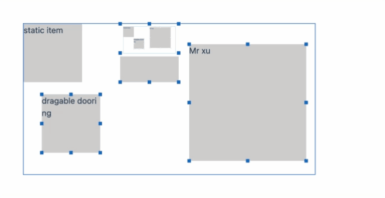
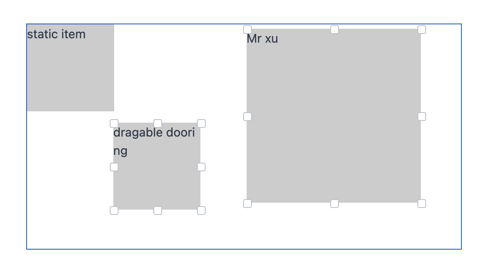
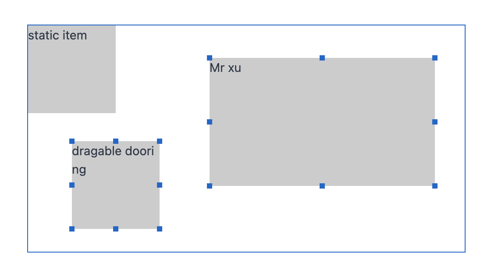

## rc-drag

rc-drag is a react-based drag-and-zoom component library that provides a flexible drag configuration and allows us to scale from different angles. ❤️ Mobile drag and drop is supported.

## Table of Contents

- [Demos](#demos)
- [Installation](#installation)
- [API](#api)
- [Usage](#usage)
- [Partner project](#partner-project)
- [Contribute](#contribute)
- [TODO List](#todo-list)

## Demos




## Installation

``` bash
npm i @alex_xu/rc-drag
```
or
``` bash
yarn add @alex_xu/rc-drag
```

## API
|  参数  |  说明  |  类型  |  默认值  |
|  ---   |  ---  |  ---  |  ---  |
|  container  |  画布元素或者画布id (Canvas element or canvas id) |  HTMLElement | string  | document.body |
|  pos  |  画布初始化坐标 (The canvas initializes the coordinates)  |  [x:number, y:number]  |  [0, 0]  |
|  size  |  拖拽组件大小 (Drag component size)  |  [w:number, h:number]  |  [100, 100]  |
|  isStatic  |  是否禁止拖拽(Whether drag is prohibited)  | boolean |  false  |
|  zIndex  |  拖拽元素的层级 (Drag the level of the element)  |  number  |  1  |
|  onDragStart | 鼠标拖拽开始 (The drag and drop begins) | fn | (item) => void
|  onDragStop | 鼠标拖拽结束 (The drag ends) | fn | (item) => void
|  close  |  todo  |  -  |  -  |
|  onClose  |  todo  |  -  |   - |


## usage

``` js
// 导入
import { Drag } from '@alex_xu/rc-drag'

<div id="box">
    <Drag container="#box">123</Drag>
    <Drag 
      container="#box" 
      pos={[0, 50]}
      size={[100, 100]}
    >
      
    </Drag>
</div>

```

## Partner project

- [h5-dooring](https://github.com/MrXujiang/h5-Dooring)

## Contribute

If you have a feature request, please add it as an issue or make a pull request.

If you have a bug to report, please reproduce the bug in [issue]() to help
us easily isolate it.

## TODO List

- [ ] support rotate control
- [ ] support server-rendered apps
